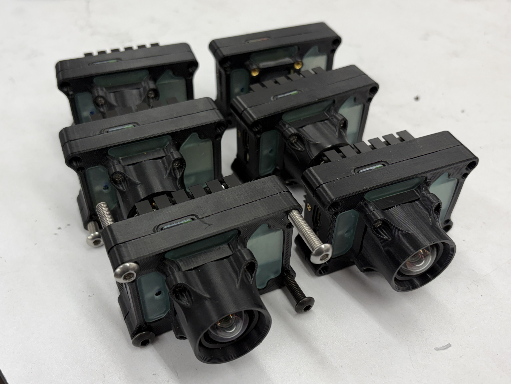
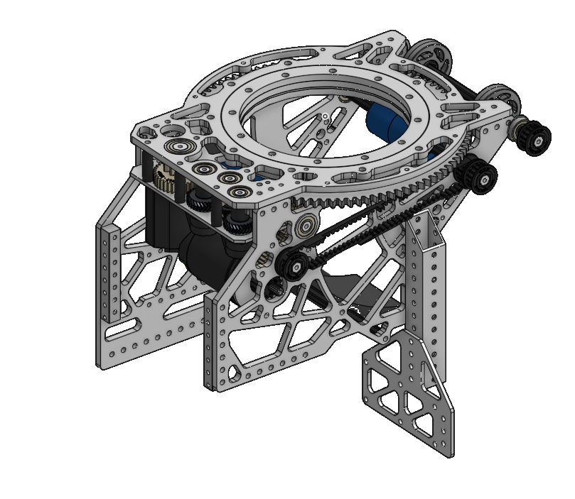
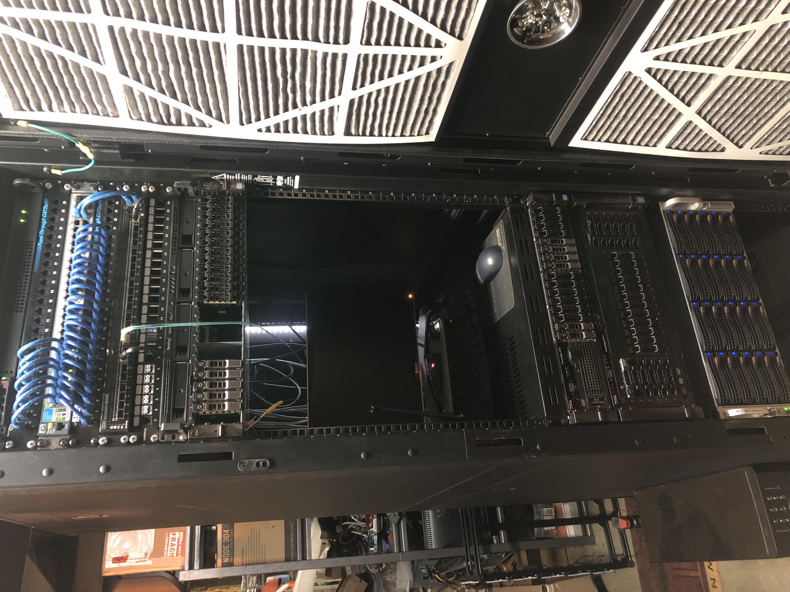
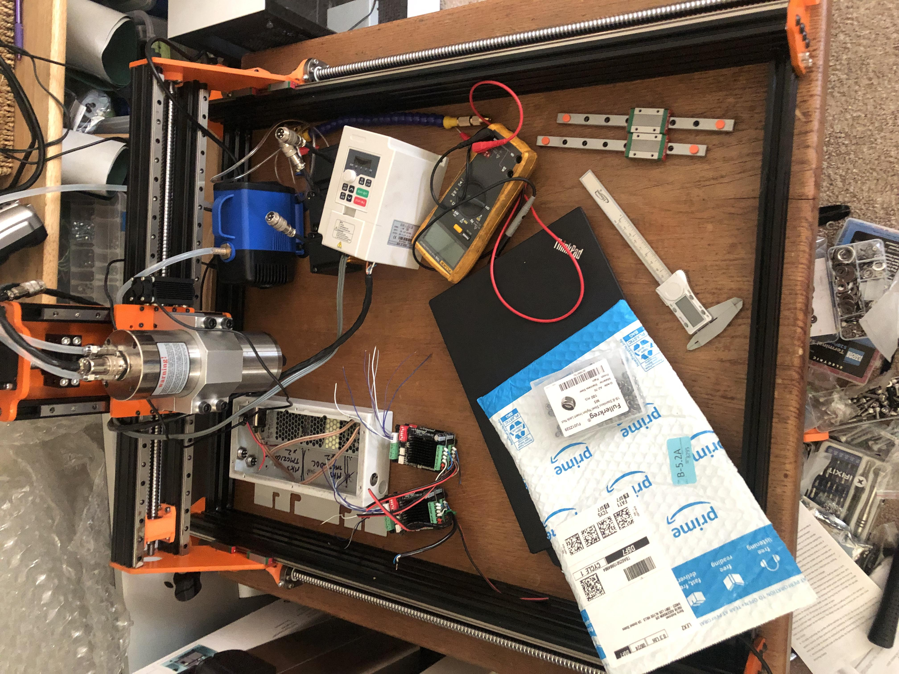

# About:

Foothill-De Anza student who enjoy working with custom embedded electronics, UAVs and homelabs as a hobby. I am largely self-taught and inspired by others.
I strive for elegance in design, maintainability, and optomization in every project I undertake.

This site serves as documentation of projects and notes.

---

# Featured Projects:

### **[lux robotics](projects/lux/)** 
open-source computer vision platform (still in development)

---

### **[FIRST robotics](projects/first/)**
subsystems of robots in the FIRST robotics competition

---

### **[Homelab⁄HPC](projects/homelab/)**
homelab cloud infrastructure and high-performance computing

---

### **[RC](projects/rc/)**
autonomous vehicles and multirotors mainly

---

### **[Miscellaneous](projects/)**
self-built CNCs, ebikes, etc

---

**Contact:** [GitHub](https://github.com/Anthony-Andrews) · [Email](mailto:anthony.r.andrews@gmail.com) · [Linkedin](https://www.linkedin.com/in/anthony-r-andrews)
