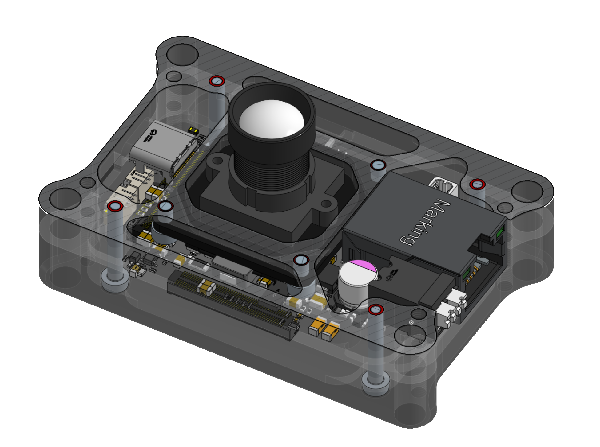
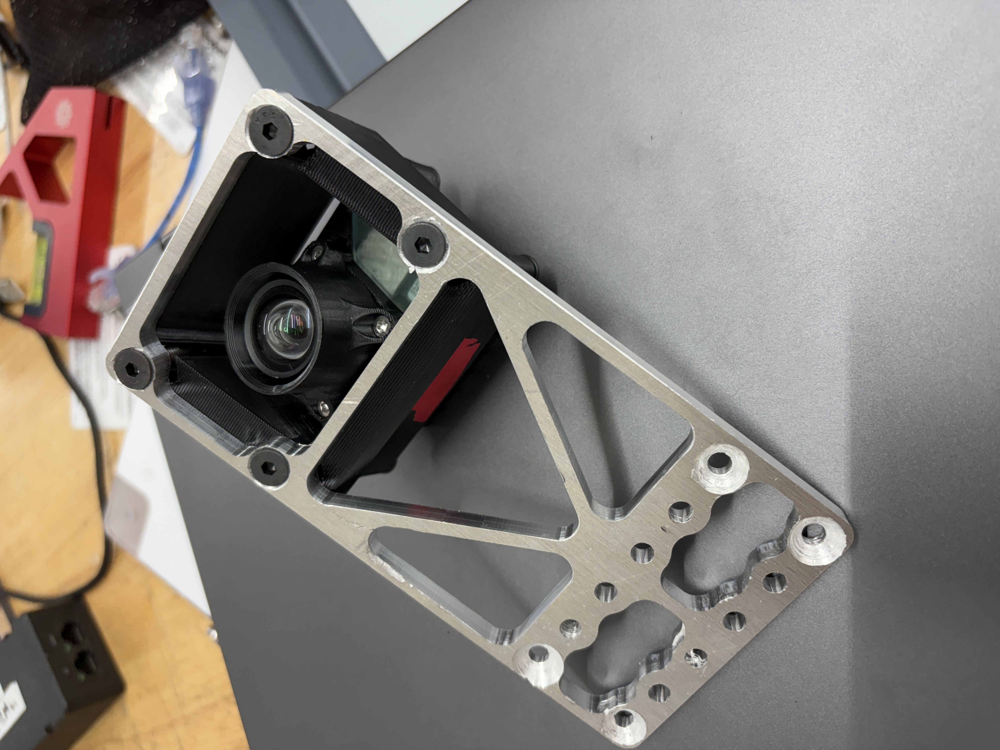

<figure>
<video src="./log_replay.mp4" autoplay loop muted playsinline disablepictureinpicture style="width: min(800px, 100%); display: block;"></video>
<figcaption>a very early version of the software stack running real-time AprilTag detection in the FIRST robotics competition</figcaption>
</figure>

## About:
lux robotics is a hardware/software/firmware project aimed at developing an open-source computer-vision edge-platform at an accessible price and high-performance ceiling.

## Hardware:
Edge-compute is handled by an 8-A55/A76-core Rockchip RK3588 based SoM.
The sensor module is built around the global-shutter AR0234 capable of 1920x1200@120fps over 4-lane mipi. 
The carrier PCB features a robust 4-48v power input, 10/100 PoE, USB-C 3.1, and a micro-sd card-slot for logging.
Real-world power draw is 9 watts average, 11 watts max.

## Software:
The current application is AprilTag detection and Perspective-n-Point pose-optomization running on the CPU alongside neural-network based object detection on the built-in 6-TOPS NPU. Later work aims to offload AprilTag detection partly to the Mali-G610 GPU. A small web-ui allows for debugging in the field.
As this is an open-source platform, the door is open to running any and all computer-vision applications.

## Firmware:
The software stack utilizes the ISP hardware of the SoC and runs debian with custom kernel device-tree drivers to acheive low-latency zero-copy, uncompressed, and configurable streaming. Libcamera integration is planned. 
An acompanying desktop app manages device emmc flashing, managing, etc.

<figure>

<figcaption>CAD of the camera alongside a side mount for autonomous scoring on a FIRST robotics competition robot</figcaption>
</figure>

<figure>
<video src="./jeffreyDemo.mp4" autoplay loop muted playsinline disablepictureinpicture style="width: min(800px, 100%); display: block;"></video>
<figcaption>CAD of the camera alongside a side mount for autonomous scoring on a FIRST robotics competition robot</figcaption>
</figure>

<figure>
<video src="./latencytest.mp4" autoplay loop muted playsinline disablepictureinpicture style="width: min(800px, 100%); display: block;"></video>
<figcaption>CAD of the camera alongside a side mount for autonomous scoring on a FIRST robotics competition robot</figcaption>
</figure>

<figure>

<figcaption>CAD of the camera alongside a side mount for autonomous scoring on a FIRST robotics competition robot</figcaption>
</figure>

<figcaption>a very early version of the software stack running real-time AprilTag detection in the FIRST robotics competition</figcaption>
</figure>

More info to come at [luxrobotics.io](https://luxrobotics.io)

---

## Hardware Iterations: