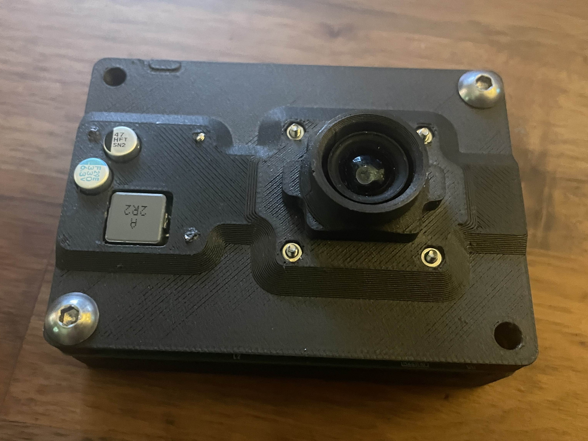
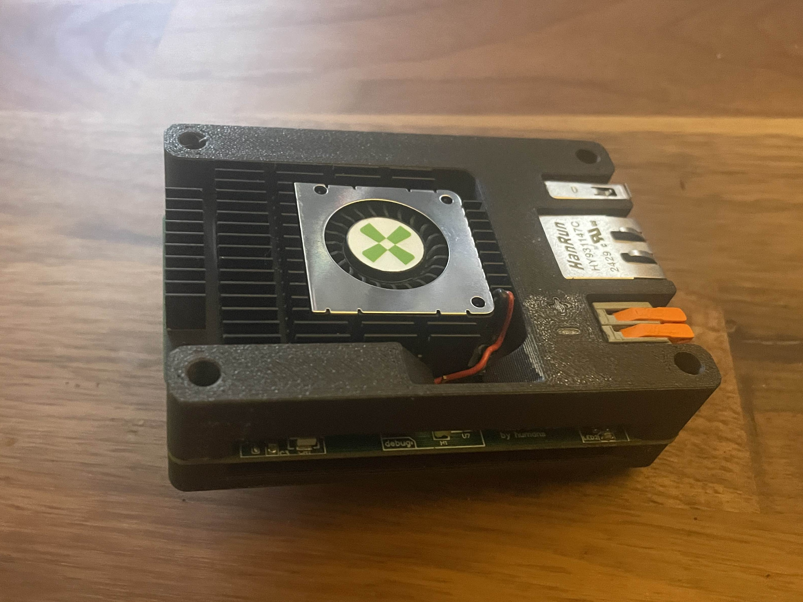
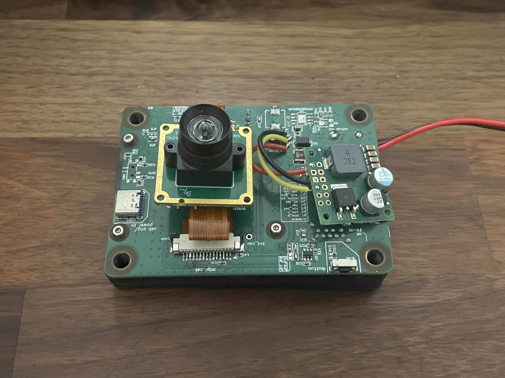
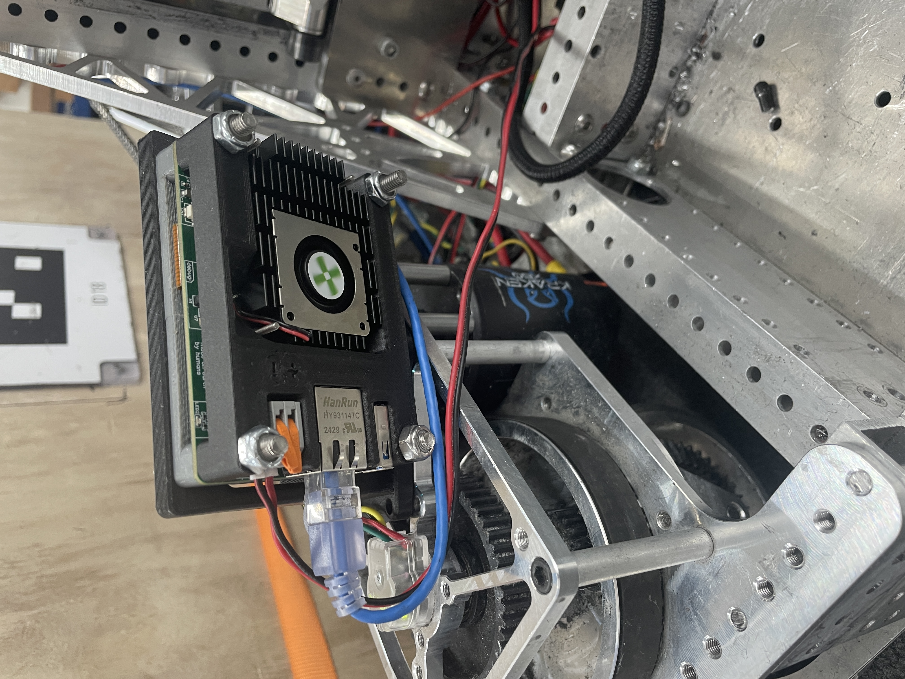
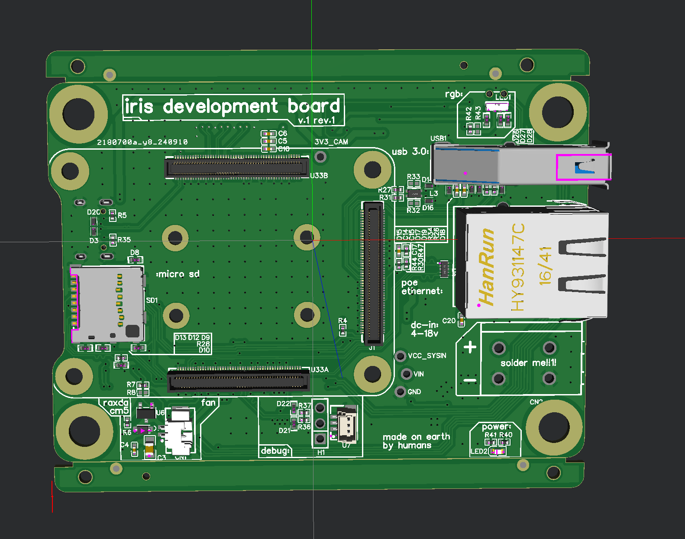
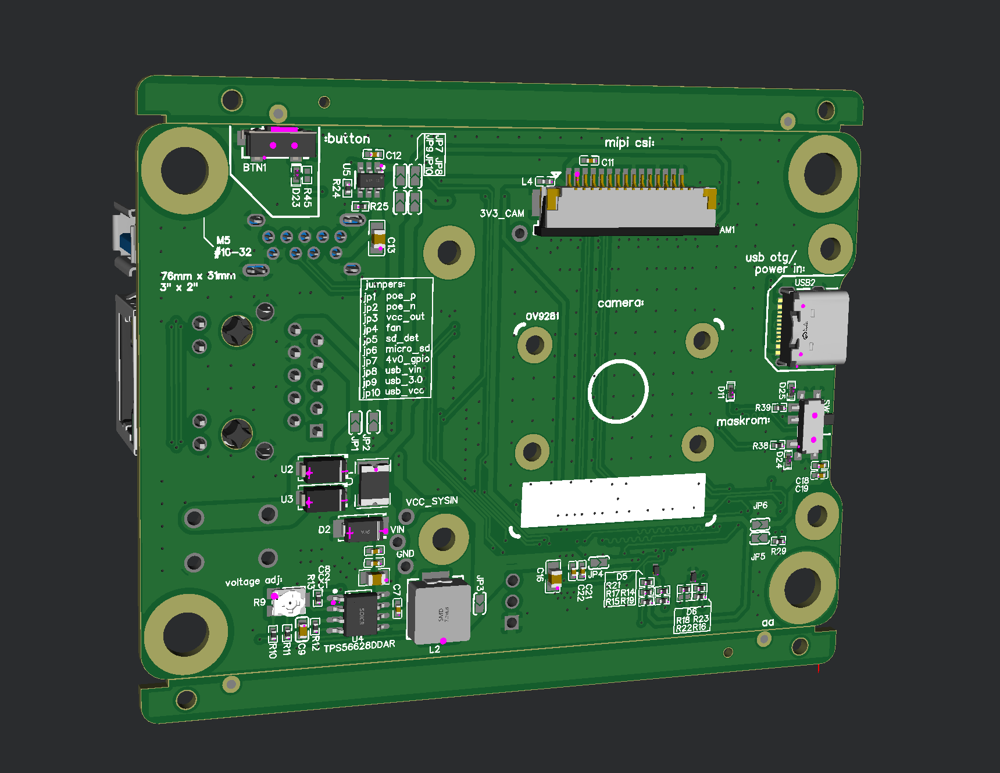
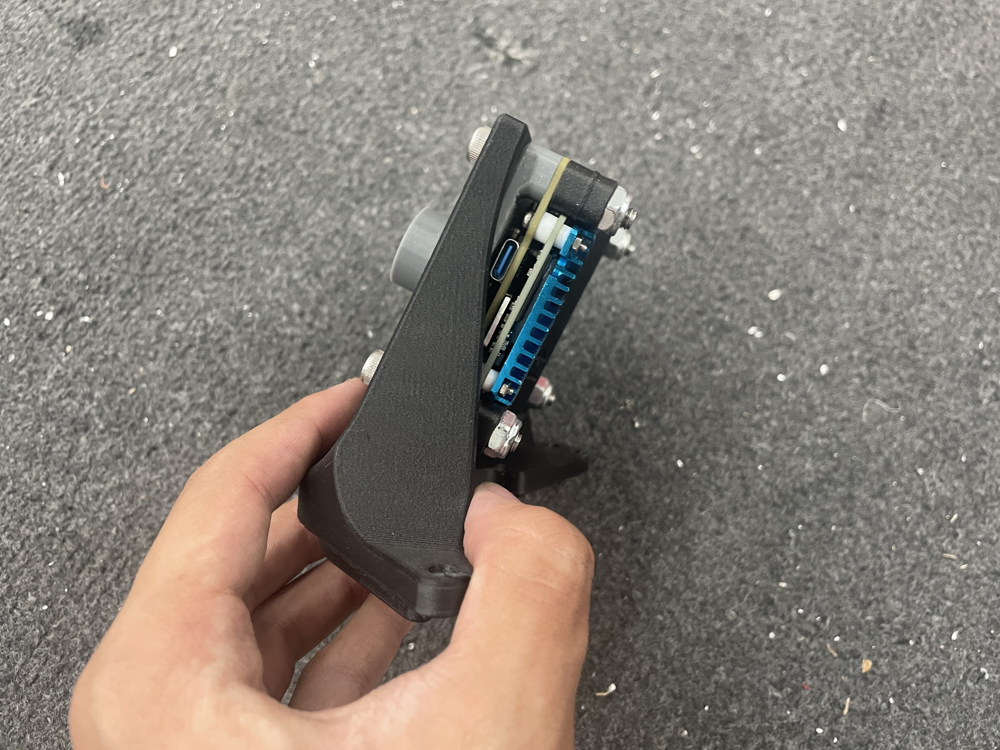
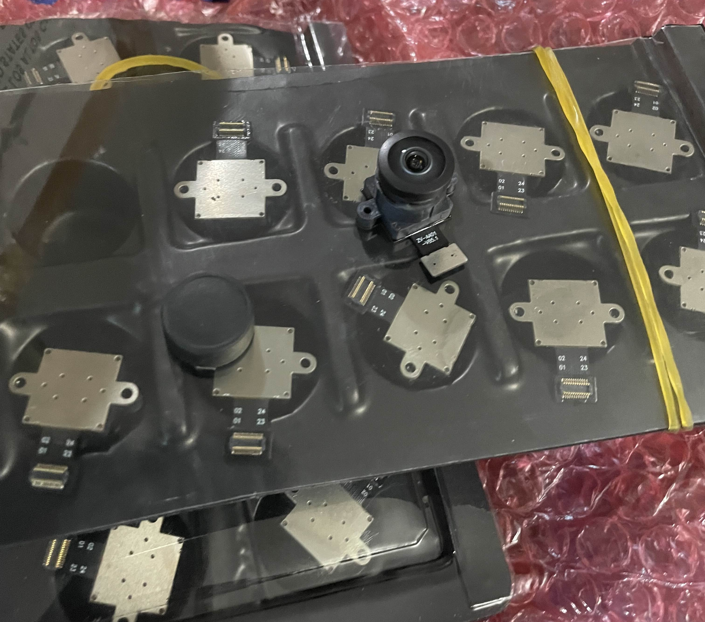
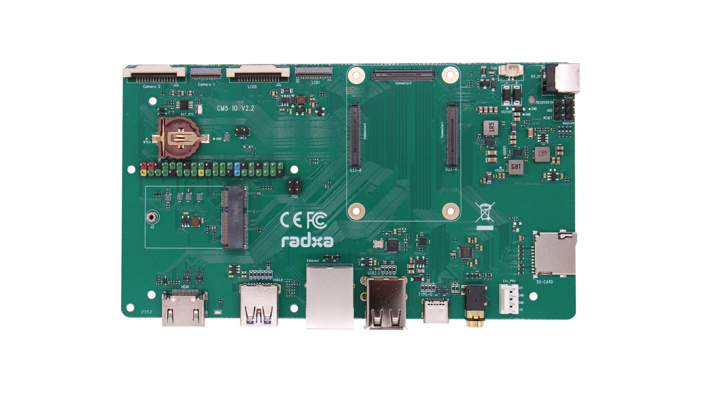
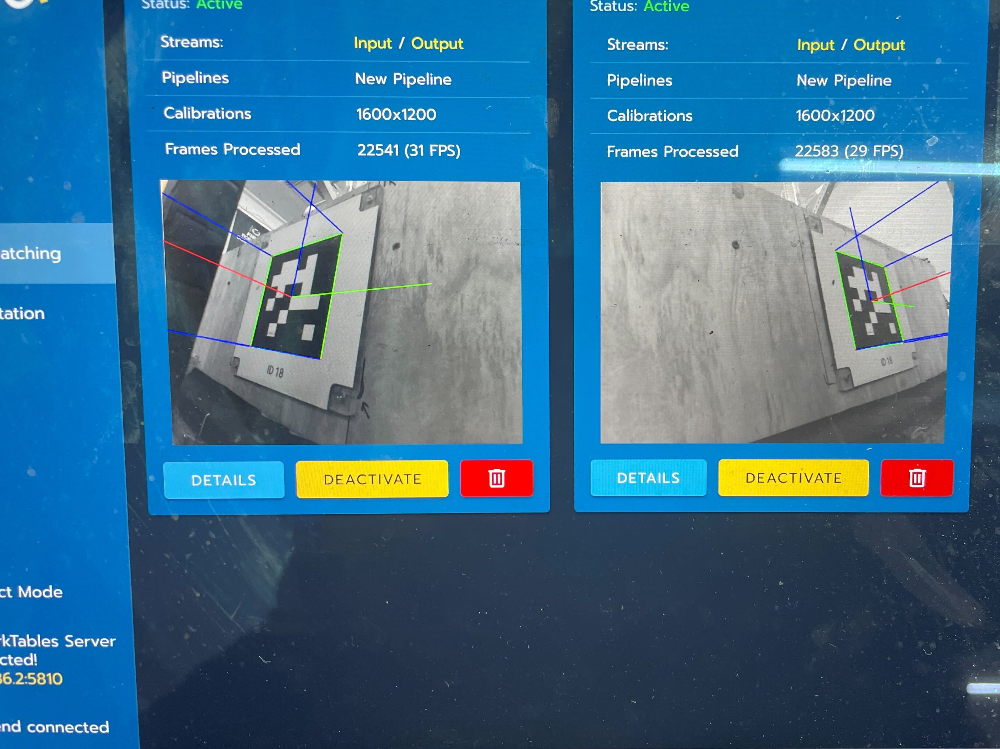

<figure>
<video src="./2025-09-24 00-07-49.mp4" controls disablepictureinpicture style="width: min(800px, 100%); display: block;"></video>
<figcaption>a very early version of the software stack running real-time AprilTag detection in the FIRST robotics competition</figcaption>
</figure>

## Related

- [FIRST robotics](projects/first/)

**Source code:** [Github](https://github.com/Anthony-Andrews/anthony-andrews.github.io) feel free to PR changes.